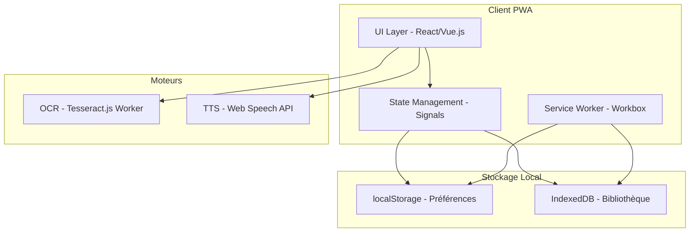

# Guide de Développement PWA Dys-Play

## ⚠️ IMPORTANT - À Lire en Premier

### Contradictions entre les Versions du Cahier des Charges

| Élément | Version "Accessibilité & Performance" | Version "Intégrale" | Recommandation |
|---------|---------------------------------------|---------------------|----------------|
| **Target users** | Dyslexie, Dysorthographie, Syndrome dysexécutif | + TDA/H ajouté | ✅ Version Intégrale |
| **US.10** | Aide à la saisie (messages d'erreur) | Bibliothèque Locale (Offline) | ⚠️ Conflit - Clarifier |
| **Performance feedback** | Transitions douces (200ms) | Réactivité <100ms | ⚠️ Conflit - Version Intégrale prioritaire |
| **Opacité masque** | Non mentionnée | Paramétrable | ✅ Version Intégrale |
| **UI Pattern** | Drawer escamotable | Tiroirs (Drawers) explicitement | ✅ Versions cohérentes |
| **Champs IndexedDB** | Non détaillés | id, text_content, language, timestamp, thumbnail | ✅ Version Intégrale |
| **RGAA Navigation** | Navigation clavier standard | + Touche Echap pour fermer menus | ✅ Version Intégrale |

---

## Table des Matières
1. [Vue d'Ensemble](#vue-densemble)
2. [Spécifications Fonctionnelles](#spécifications-fonctionnelles)
3. [Architecture Technique](#architecture-technique)
4. [Conformité RGAA](#conformité-rgaa)
5. [Conformité RGPD](#conformité-rgpd)
6. [UI/UX Design](#uiux-design)
7. [État Actuel du Prototype](#état-actuel-du-prototype)
8. [Feuille de Route](#feuille-de-route)

---

## 1. Vue d'Ensemble

### 1.1 Description du Projet
Dys-Play est une Progressive Web Application (PWA) de **lecture augmentée** conçue pour les personnes présentant des troubles Dys:
- **Dyslexie**
- **Dysorthographie**
- **TDA/H** (ajouté dans Version Intégrale)
- **Syndrome dysexécutif**

### 1.2 Objectifs Principaux
- **Autonomie totale** de lecture sur tous supports (numériques ou physiques)
- Adaptation **"Live"** et personnalisée de l'interface
- **Confidentialité absolue** des données (Local-First)
- Performance: **réactivité <100ms** pour les modifications visuelles

### 1.3 Emplacement du Projet
```
/Users/remi/Library/CloudStorage/ProtonDrive-remi@posthack.com-folder/2-PostHack/2-projets dev/dys-play/
```

### 1.4 Références des Documents
| Document | Fichier |
|----------|---------|
| Cahier des Charges Version Intégrale | [`Cahier des Charges _ Dys-Play - Version Intégrale.pdf`](2-projets%20dev/dys-play/Cahier%20des%20Charges%20_%20Dys-Play%20-%20Version%20Intégrale.pdf) |
| Prototype | [`index.html`](2-projets%20dev/dys-play/index.html) |

---

## 2. Spécifications Fonctionnelles

### 2.1 Matrice des User Stories

| ID | Description | Priorité | Status Prototype |
|----|-------------|----------|-----------------|
| **US.1** | Scanner un texte imprimé avec la caméra (OCR Local Tesseract.js) | Haute | ✅ |
| **US.2** | Importer un PDF ou une image | Haute | ⚠️ Partiel |
| **US.3** | Saisir du texte au clavier (éditeur Dys-Friendly) | Moyenne | ✅ |
| **US.4** | Changer police + interlettrage (>0.12em) + interlignage (>1.5) | Moyenne | ✅ |
| **US.5** | Mode Zèbre (alternance couleurs) | Moyenne | ✅ |
| **US.6** | Syllabation Dynamique (coloration bicolore) | Moyenne | ✅ |
| **US.7** | TTS avec suivi visuel (highlight synchrone) | Haute | ✅ |
| **US.8** | Règle "Focus Mask" (occlusion environnement) | Haute | ✅ |
| **US.9** | i18n (FR, EN, AR + RTL) | Moyenne | ✅ |
| **US.10** | Bibliothèque Locale (IndexedDB offline) | Haute | ✅ |

> ⚠️ **NOTE**: US.10 diffère entre versions. Version Intégrale = Bibliothèque Offline. Ancienne version = Aide à la saisie.

### 2.2 Détail des Fonctionnalités Clés

#### US.1 - OCR Local (Tesseract.js)
```
Implémentation: Web Worker pour ne pas figer l'interface
Source: [lignes 1-19, 170-173 du prototype](2-projets%20dev/dys-play/index.html)
Status: Fonctionnel
```

#### US.7 - TTS avec Suivi Visuel
```
API: Web Speech API (SpeechSynthesis)
Fonctionnalités:
  - Détection automatique des voix locales
  - Surbrillance synchrone du mot lu
  - Défilement automatique
  - Vitesse调节able (0.5x à 2x)
Source: [lignes 443-477 du prototype](2-projets%20dev/dys-play/index.html)
```

#### US.8 - Règle Focus Mask
```
Implémentation: CSS mask-image
Interactions:
  - Suivi tactile (doigt)
  - Suivi TTS (mot dicté)
  - Opacité paramétrable (NOUVEAU - Version Intégrale)
Source: [lignes 51-97, 359-402 du prototype](2-projets%20dev/dys-play/index.html)
```

---

## 3. Architecture Technique

### 3.1 Stack Technique Cible (Version Intégrale)

| Composant | Technologie | Status |
|-----------|-------------|--------|
| Framework UI | React ou Vue.js | ⏳ À migrer |
| Moteur OCR | Tesseract.js (Web Workers) | ✅ |
| Synthèse Vocale | Web Speech API | ✅ |
| Offline | Service Workers (Workbox) | ⏳ À implémenter |
| Stockage Préférences | localStorage | ✅ |
| Stockage Documents | IndexedDB | ✅ |
| Tests | Jest + Axe-core | ⏳ À mettre en place |

### 3.2 Schéma Architecture



### 3.3 Schéma IndexedDB (Version Intégrale)

```
Table: library
├── id (autoIncrement)
├── text_content (string)
├── language (string: 'fr' | 'en' | 'ar')
├── timestamp (number)
└── thumbnail (string, optionnel)
```

---

## 4. Conformité RGAA

### 4.1 Niveau Cible: WCAG 2.1 AAA

| Critère | Exigence | Status Prototype |
|---------|----------|-----------------|
| **Contraste** | Ratio 7:1 minimum | ⚠️ À vérifier |
| **Mode contrasté** | Sépia, Sombre, Clair | ✅ |
| **Cibles tactiles** | Minimum 44x44px | ✅ |
| **Focus visible** | Bordure 4px minimum | ✅ |
| **Lecture d'écran** | Support total | ⚠️ À tester |
| **Navigation clavier** | Complète + Echap pour fermer | ⚠️ À implémenter |
| **Actions couleur** | Jamais seules (icônes/textes) | ✅ |

### 4.2 Checklist Accessibilité

```markdown
- [ ] Navigation clavier complète
- [ ] Touche Echap fonctionnelle (menus, drawers)
- [ ] Indicateur focus visible (4px minimum)
- [ ] Contraste 7:1 sur tous les éléments
- [ ] Alternative textuelle aux images
- [ ] Pas de的信息 transmise uniquement par couleur
- [ ] Hiérarchie titres stricte (h1→h2→h3)
```

---

## 5. Conformité RGPD

### 5.1 Principe Local-First
```
_aucun_ texte ou image n'est envoyé sur un serveur
100% du traitement (OCR/TTS) et stockage (IndexedDB) locaux
```

### 5.2 Fonctionnalités RGPD

| Fonctionnalité | Implémentation |
|----------------|----------------|
| Droit à l'oubli | "Réinitialisation d'usine" (supprime IndexedDB + localStorage) |
| Consentement | Demandes permissions explicites (caméra, stockage) |
| Transparence | Mention du fonctionnement offline |

> ✅ Implémenté dans prototype [ligne 300](2-projets%20dev/dys-play/index.html)

---

## 6. UI/UX Design

### 6.1 Principes Directeurs (Version Intégrale)

| Principe | Exigence |
|----------|----------|
| **Éviter surcharge cognitive** | Tiroirs (Drawers) escamotables pour réglages |
| **Feedback immédiat** | Modification répercutée en **<100ms** |
| **Affordance** | Icônes Lucide-React + libellés textuels |

> ⚠️ **CONTRADICTION**: Ancienne version mentionnait transitions 200ms. Version Intégrale exige <100ms. **Version Intégrale prioritaire.**

### 6.2 Règle de Lecture Avancée (Focus Mask)

```css
.mask-reading {
    mask-image: linear-gradient(
        to bottom,
        black 0%,
        black var(--mask-top),
        transparent var(--mask-top),
        transparent var(--mask-bottom),
        black var(--mask-bottom),
        black 100%
    );
}
```

### 6.3 Interactions Requises

| Interaction | Implémentation |
|-------------|----------------|
| Suivi tactile | Doigt suit la position Y |
| Suivi TTS | Fenêtre suit le mot dicté |
| Opacité | Curseur de调节 (NOUVEAU) |

---

## 7. État Actuel du Prototype

### 7.1 Fonctionnalités Déjà Implémentées ✅

1. ✅ Interface Responsive (Tailwind CSS)
2. ✅ OCR avec Tesseract.js
3. ✅ Règle de lecture (Focus Mask)
4. ✅ Mode Zèbre
5. ✅ Coloration syllabique
6. ✅ TTS avec synchronisation
7. ✅ Réglages typographiques (police, taille, espacement)
8. ✅ Bibliothèque locale (IndexedDB)
9. ✅ Thèmes (Light/Dark/Cream)
10. ✅ Support multilingue (fr/en/ar)
11. ✅ Navigation responsive
12. ✅ Feedback visuel (Lucide icons)

### 7.2 Fonctionnalités Manquantes ⏳

| Fonctionnalité | Priorité | Notes |
|----------------|----------|-------|
| Migration React/Vue.js | Haute | Pour meilleure réactivité |
| Workbox/Service Worker | Haute | Mode offline complet |
| Opacité masque paramétrable | Moyenne | Nouveau dans Version Intégrale |
| Touche Echap | Moyenne | Navigation clavier RGAA |
| Tests Jest | Moyenne | Couverture 80% |
| Axe-core automatisé | Moyenne | Audit accessibilité |
| CI/CD | Faible | Vercel/Firebase |
| Page Mentions Légales | Faible | Transparence RGPD |

### 7.3 Gap Analysis (Prototype vs Version Intégrale)

```
Fonctionnalité              | Prototype | Version Intégrale | Gap
----------------------------|-----------|-------------------|-----
Réactivité <100ms           | ⚠️ ~200ms | ✅ <100ms          | Optimiser JS
Opacité masque              | ❌        | ✅ Paramétrable    | Ajouter slider
Echap fermer menus          | ❌        | ✅ Requis          | Ajouter event
IndexedDB fields detail    | ❌        | ✅ thumbnail opt   | Migration BDD
UI Drawers                  | ✅        | ✅ Confirmé        | OK
```

---

## 8. Feuille de Route

### Phase 1: Optimisation Performance (1-2 semaines)
- [ ] Optimiser réactivité JavaScript (<100ms)
- [ ] Ajouter opacité paramétrable au Focus Mask
- [ ] Implémenter touche Echap pour drawers
- [ ] Audit Lighthouse performance

### Phase 2: Accessibilité (1-2 semaines)
- [ ] Tests navigation clavier complète
- [ ] Vérification contrastes 7:1
- [ ] Ajout labels ARIA manquants
- [ ] Audit Axe-core

### Phase 3: Architecture (3-4 semaines)
- [ ] Migration vers React ou Vue.js
- [ ] Implémentation Workbox
- [ ] Refactorisation composants
- [ ] Documentation technique

### Phase 4: Qualité (2 semaines)
- [ ] Tests unitaires Jest (80% couverture)
- [ ] Tests e2e Playwright
- [ ] Pipeline CI/CD
- [ ] Monitoring Sentry

---

## 9. Annexes

### 9.1 Ressources Techniques
- Tesseract.js: https://tesseract.projectnaptha.com/
- WCAG 2.1: https://www.w3.org/WAI/WCAG21/quickref/
- Workbox: https://developers.google.com/web/tools/workbox
- Lucide Icons: https://lucide.dev/
- RGAA 3: https://www.numerique.gouv.fr/publications/rgaa-accessibilite/

### 9.2 Historique des Versions

| Version | Date | Changements |
|---------|------|-------------|
| 1.0 | 2026-02-03 | Version initiale intégrant Version Intégrale |

---

*Document généré le: 2026-02-03*
*Version: 1.0*
*Sources: Cahier des Charges Version Intégrale + Prototype index.html*
